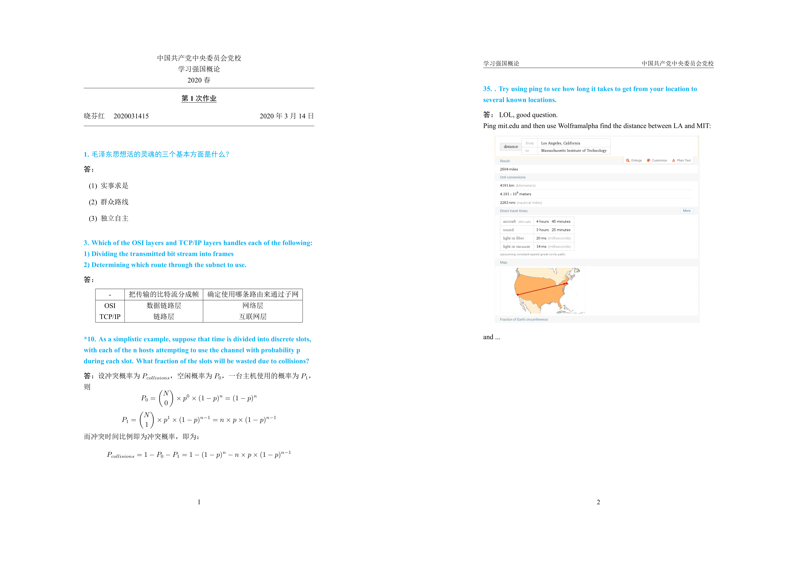

# latex-homework
A personal latex template for course homework modified from thucoursework.
## usage
latexml is recommended, use `latexmk homework.tex` to compile automatically.
> [Latexmk](https://mg.readthedocs.io/latexmk.html) is a Perl script which you just have to run once and it does everything else for you … completely automagically.
## demo

